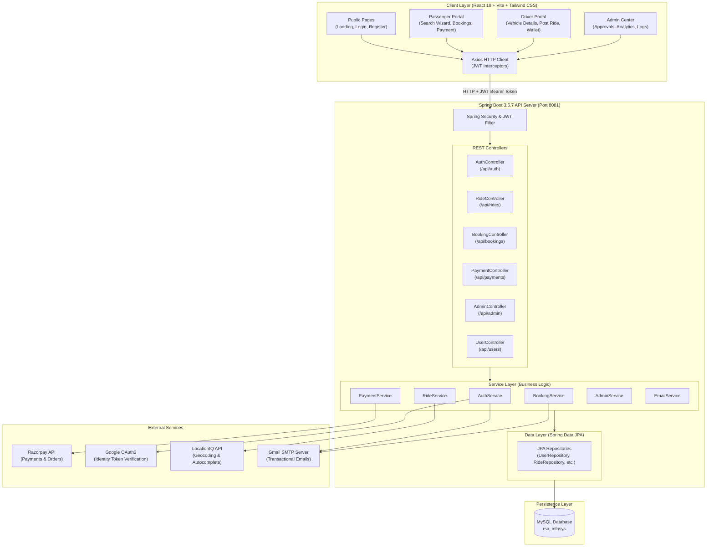
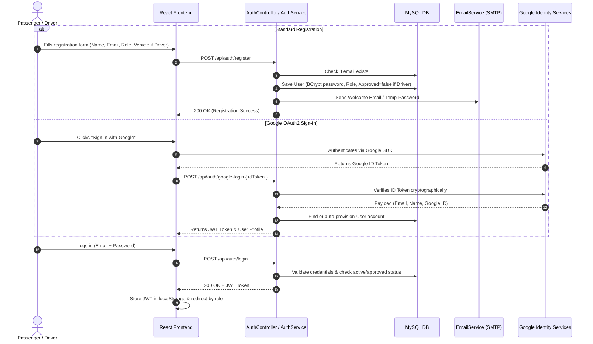
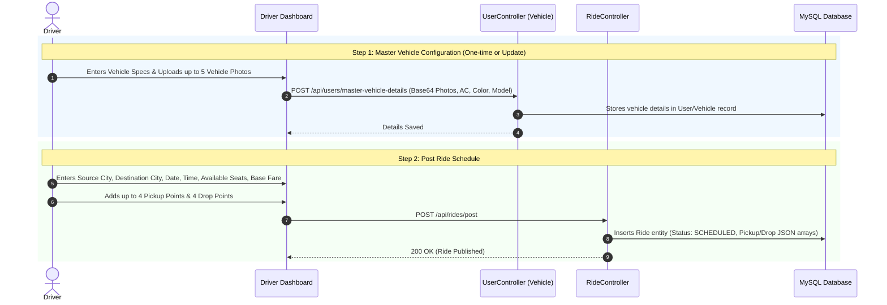
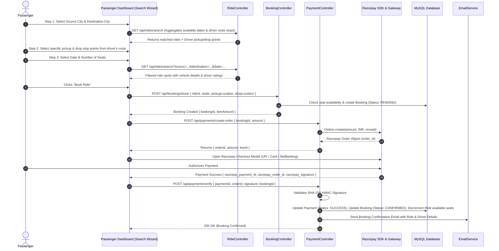
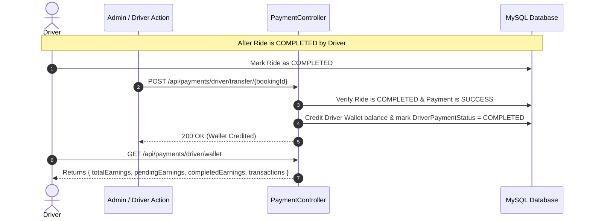
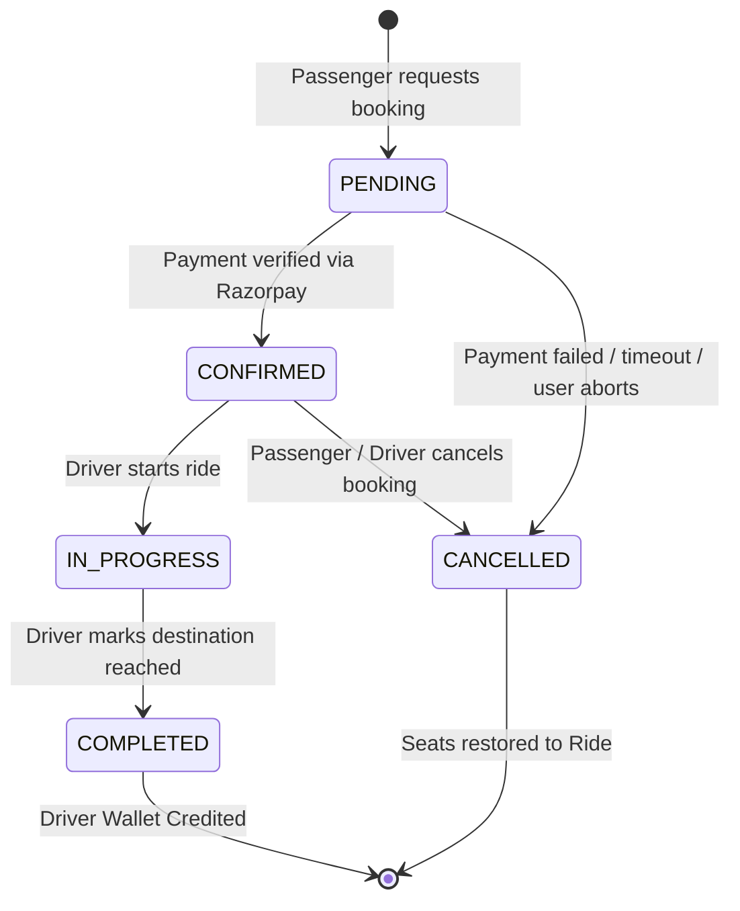
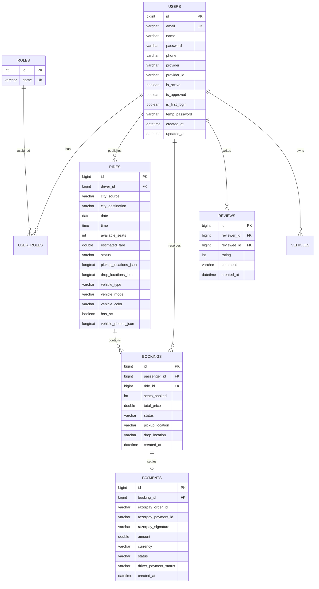

# 🚗 Smart Ride Sharing Application (RSA)

[](https://spring.io/projects/spring-boot)
[](https://www.oracle.com/java/)
[](https://react.dev/)
[](https://vitejs.dev/)
[](https://tailwindcss.com/)
[](https://www.mysql.com/)
[](https://razorpay.com/)
[](LICENSE)

A full-stack, enterprise-grade ride sharing and carpooling platform designed to connect drivers with empty seats to commuters traveling along similar routes. The platform streamlines ride discovery, multi-stop pickup/drop location coordination, instant seat booking, secure online payments via Razorpay (UPI, Cards, NetBanking), real-time email notifications, and comprehensive administrative oversight.

---

## 📋 Table of Contents

- [Key Highlights](#-key-highlights)
- [System Architecture](#-system-architecture)
- [System Workflow & Flow Diagrams](#-system-workflow--flow-diagrams)
  - [1. User Onboarding & Authentication Flow](#1-user-onboarding--authentication-flow)
  - [2. Driver Ride Publishing Flow](#2-driver-ride-publishing-flow)
  - [3. Passenger Multi-Step Search & Booking Flow](#3-passenger-multi-step-search--booking-flow)
  - [4. Payment Processing (Razorpay & Driver Wallet) Flow](#4-payment-processing-razorpay--driver-wallet-flow)
  - [5. Booking Lifecycle State Machine](#5-booking-lifecycle-state-machine)
- [Core Features by Role](#-core-features-by-role)
  - [Passenger Features](#passenger-features)
  - [Driver Features](#driver-features)
  - [Administrator Features](#administrator-features)
- [Technology Stack](#-technology-stack)
- [Database Schema & Relationships](#-database-schema--relationships)
- [REST API Reference](#-rest-api-reference)
- [Third-Party Integrations Setup](#-third-party-integrations-setup)
- [Getting Started & Local Setup](#-getting-started--local-setup)
  - [Prerequisites](#prerequisites)
  - [1. Database Configuration](#1-database-configuration)
  - [2. Backend Setup](#2-backend-setup)
  - [3. Frontend Setup](#3-frontend-setup)
- [Default System Credentials](#-default-system-credentials)
- [Testing & Quality Assurance](#-testing--quality-assurance)
- [Project Directory Structure](#-project-directory-structure)

---

## 🌟 Key Highlights

- **Multi-Stop Route Matching**: Drivers can define up to 4 custom pickup locations and 4 drop locations per route; passengers can filter rides based on specific pickup/drop stops.
- **Master Vehicle Management**: Drivers can upload and store vehicle specifications (AC, color, capacity, model) and multiple vehicle exterior/interior images once, automatically reusing them across scheduled rides.
- **Complete Razorpay Payment Lifecycle**: Full end-to-end checkout supporting UPI (Google Pay, PhonePe, Paytm, BHIM), Credit/Debit Cards, NetBanking, and digital wallets, with SHA-256 HMAC signature verification and automatic driver wallet credit.
- **Social & Standard Authentication**: Dual login options via Google OAuth2 ID Token verification and standard email/password credentials with BCrypt hashing and JWT session management.
- **Automated Email Notifications**: SMTP-powered instant notifications for account registration, temporary credentials, booking confirmation, ride status updates, and cancellations.
- **Interactive Admin Control Center**: Administrative dashboard featuring driver verification workflows, user management, financial statistics, platform KPI metrics, and CSV reporting.

---

## 🏗 System Architecture

The application adopts a decoupled **Single Page Application (SPA) + Monolithic RESTful API** architecture:



---

## 🔄 System Workflow & Flow Diagrams

### 1. User Onboarding & Authentication Flow



---

### 2. Driver Ride Publishing Flow



---

### 3. Passenger Multi-Step Search & Booking Flow



---

### 4. Payment Processing (Razorpay & Driver Wallet) Flow



---

### 5. Booking Lifecycle State Machine



---

## 👥 Core Features by Role

### Passenger Features
- **Smart City & Stop Search**: Autocomplete search for source and destination cities with multi-stop pickup/drop filter aggregation.
- **Vehicle Inspection**: View driver vehicle photos, color, model, AC availability, and driver ratings before booking.
- **Seamless Checkout**: Multiple payment options (UPI, GPay, PhonePe, Cards, NetBanking) via Razorpay.
- **Real-Time Booking Management**: View active bookings, cancel rides with automatic seat restoration, and download/print ride receipts.
- **Ride History & Reviews**: Complete historical trip log with the ability to submit star ratings and text reviews for drivers.

### Driver Features
- **Vehicle Profile Hub**: Store and update master vehicle details, capacity, features, and multiple vehicle photos.
- **Flexible Ride Publishing**: Schedule one-time or recurring rides with customizable base fare, seat capacity, departure time, and up to 4 pickup and 4 drop waypoints.
- **Booking Management**: Accept, reject, or monitor passenger bookings with real-time seat availability calculation.
- **Trip Lifecycle Control**: Mark rides as Scheduled, In-Progress, or Completed.
- **Earnings & Wallet Tracker**: Real-time summary of total earnings, pending payouts, completed payouts, and historical transaction logs.

### Administrator Features
- **Platform Analytics**: Comprehensive statistics including total registered users, active drivers, passenger count, total bookings, platform revenue, and weekly/monthly growth charts.
- **Driver Verification**: Review driver registration requests, inspect submitted driver licenses and vehicle details, and approve or reject drivers.
- **User Management**: Activate, suspend, or inspect user accounts and assigned roles.
- **Data Export**: Export pending driver applications and platform performance metrics to downloadable CSV files.

---

## 💻 Technology Stack

| Layer | Technology | Purpose |
| :--- | :--- | :--- |
| **Frontend Framework** | React 19 + Vite 7 | High-performance Single Page Application (SPA) |
| **Styling & UI** | Tailwind CSS 3.4 + Lucide Icons | Responsive modern design and icon system |
| **Notifications & Modals** | SweetAlert2 | Interactive confirmation dialogs and toasts |
| **Routing** | React Router v7 | Client-side routing with guarded role routes |
| **HTTP Client** | Axios | REST communication with JWT interceptors |
| **Backend Framework** | Spring Boot 3.5.7 | Enterprise Java application server |
| **Language** | Java 17 / Java 21 | Modern Java runtime |
| **Security & Auth** | Spring Security 6 + JJWT | JWT authentication and role-based access control |
| **ORM & Persistence** | Spring Data JPA + Hibernate 6 | Object-relational mapping and repository abstraction |
| **Database** | MySQL 8.0 / MariaDB | Relational database storage |
| **Payment Gateway** | Razorpay Java SDK 1.4.3 | Payment order creation, verification, and webhooks |
| **Geocoding & Maps** | LocationIQ REST API | Address lookup and coordinate calculation |
| **Social Login** | Google OAuth2 API Client | Google ID token cryptographic verification |
| **Email Service** | Spring Boot Starter Mail (JavaMail) | SMTP transactional email delivery |
| **Documentation** | SpringDoc OpenAPI (Swagger UI) | Interactive API exploration |
| **Code Quality & Testing** | JUnit 5 + Mockito + JaCoCo + ESLint | Automated test runner, coverage reporting, and linting |

---

## 🗄 Database Schema & Relationships



---

## 📡 REST API Reference

### 🔐 Authentication (`/api/auth`)
| Method | Endpoint | Access | Description |
| :--- | :--- | :--- | :--- |
| `POST` | `/api/auth/register` | Public | Register new Passenger or Driver account |
| `POST` | `/api/auth/login` | Public | Authenticate with email/password and obtain JWT |
| `POST` | `/api/auth/google-login` | Public | Authenticate via Google ID Token |
| `POST` | `/api/auth/change-password` | Authenticated | Change initial/temporary password |

### 🚗 Rides (`/api/rides`)
| Method | Endpoint | Access | Description |
| :--- | :--- | :--- | :--- |
| `POST` | `/api/rides/post` | Driver | Publish a new scheduled ride |
| `GET` | `/api/rides/search` | Public | Search rides with filters (source, destination, date) |
| `GET` | `/api/rides/{id}` | Authenticated | Fetch specific ride details |
| `GET` | `/api/rides/my-rides` | Driver | Fetch all rides published by current driver |
| `PUT` | `/api/rides/{id}/status` | Driver | Update ride status (`SCHEDULED`, `IN_PROGRESS`, `COMPLETED`, `CANCELLED`) |
| `DELETE`| `/api/rides/{id}` | Driver | Cancel and remove scheduled ride |

### 🎟 Bookings (`/api/bookings`)
| Method | Endpoint | Access | Description |
| :--- | :--- | :--- | :--- |
| `POST` | `/api/bookings/book` | Passenger | Create pending ride booking |
| `GET` | `/api/bookings/my-bookings` | Passenger | Fetch paginated passenger active bookings |
| `GET` | `/api/bookings/passenger/history` | Passenger | Fetch paginated historical passenger bookings |
| `GET` | `/api/bookings/driver/bookings` | Driver | Fetch bookings for rides owned by current driver |
| `PUT` | `/api/bookings/{id}/confirm` | Driver | Confirm booking request |
| `PUT` | `/api/bookings/{id}/cancel` | Authenticated | Cancel booking & restore seats |

### 💳 Payments (`/api/payments`)
| Method | Endpoint | Access | Description |
| :--- | :--- | :--- | :--- |
| `POST` | `/api/payments/create-order` | Passenger | Create Razorpay order ID for booking |
| `POST` | `/api/payments/verify` | Passenger | Verify payment signature and confirm booking |
| `GET` | `/api/payments/passenger/history` | Passenger | Retrieve passenger payment receipt logs |
| `GET` | `/api/payments/driver/wallet` | Driver | Retrieve driver wallet balance and payout summary |
| `GET` | `/api/payments/driver/history` | Driver | Retrieve driver earnings transaction log |
| `POST` | `/api/payments/driver/transfer/{bookingId}` | Admin/Driver | Transfer completed ride earnings to driver wallet |

### 👤 Users & Vehicles (`/api/users`)
| Method | Endpoint | Access | Description |
| :--- | :--- | :--- | :--- |
| `GET` | `/api/users/profile` | Authenticated | Retrieve profile details of logged-in user |
| `PUT` | `/api/users/profile` | Authenticated | Update user profile information |
| `GET` | `/api/users/master-vehicle-details` | Driver | Get saved master vehicle configuration |
| `POST` | `/api/users/master-vehicle-details` | Driver | Save/update master vehicle specifications and photos |

### 🛡 Admin (`/api/admin`)
| Method | Endpoint | Access | Description |
| :--- | :--- | :--- | :--- |
| `GET` | `/api/admin/stats` | Admin | Get platform metrics (users, rides, revenue) |
| `GET` | `/api/admin/drivers/pending` | Admin | List driver accounts awaiting approval |
| `PUT` | `/api/admin/drivers/{id}/approve` | Admin | Approve driver account |
| `PUT` | `/api/admin/drivers/{id}/reject` | Admin | Reject driver application |
| `GET` | `/api/admin/drivers/all` | Admin | Get complete driver list |
| `GET` | `/api/admin/passengers/all` | Admin | Get complete passenger list |

---

## ⚙ Third-Party Integrations Setup

### 1. Razorpay Payment Gateway
1. Create an account at [Razorpay Dashboard](https://dashboard.razorpay.com/).
2. Navigate to **Settings → API Keys** and generate **Key ID** and **Key Secret**.
3. Add the keys to `src/main/resources/application.properties`:
   ```properties
   razorpay.key.id=rzp_test_YOUR_KEY_ID
   razorpay.key.secret=YOUR_KEY_SECRET
   ```

### 2. Google OAuth 2.0 Client
1. Visit the [Google Cloud Console](https://console.cloud.google.com/).
2. Create a project and configure the **OAuth consent screen**.
3. Under **Credentials**, create an **OAuth 2.0 Client ID** (Web application).
4. Add authorized JavaScript origins (`http://localhost:3000`, `http://localhost:8081`).
5. Set the client ID in `application.properties` and frontend `.env.local`:
   ```properties
   google.client.id=YOUR_GOOGLE_CLIENT_ID.apps.googleusercontent.com
   google.client.secret=YOUR_GOOGLE_CLIENT_SECRET
   ```

### 3. LocationIQ API (Geocoding & Autocomplete)
1. Sign up at [LocationIQ](https://locationiq.com/) and obtain an access token.
2. Update backend and frontend configurations:
   ```properties
   app.locationiq.key=pk.YOUR_LOCATIONIQ_KEY
   ```

### 4. Gmail SMTP Email Service
1. In your Google Account, enable 2-Step Verification and generate an **App Password**.
2. Configure Spring Mail in `application.properties`:
   ```properties
   spring.mail.host=smtp.gmail.com
   spring.mail.port=587
   spring.mail.username=your_email@gmail.com
   spring.mail.password=your_16_character_app_password
   spring.mail.properties.mail.smtp.auth=true
   spring.mail.properties.mail.smtp.starttls.enable=true
   ```

---

## 🚀 Getting Started & Local Setup

### Prerequisites
- **Java JDK**: Version 17 or 21+ installed (`java -version`)
- **Maven**: Version 3.8+ or use included `./mvnw` / `mvnw.cmd`
- **Node.js**: Version 18+ or 20+ installed (`node -v`)
- **MySQL Server**: Version 8.0+ running on port `3306`

---

### 1. Database Configuration
Create the MySQL database:
```sql
CREATE DATABASE rsa_infosys;
```

Update your database credentials in `src/main/resources/application.properties`:
```properties
spring.datasource.url=jdbc:mysql://localhost:3306/rsa_infosys?useSSL=false&allowPublicKeyRetrieval=true&serverTimezone=UTC
spring.datasource.username=root
spring.datasource.password=YOUR_MYSQL_PASSWORD
```

---

### 2. Backend Setup
Navigate to the root directory and run the Spring Boot backend:

```bash
# Using Maven Wrapper (Windows)
.\mvnw.cmd spring-boot:run

# Using Maven Wrapper (Linux/macOS)
./mvnw spring-boot:run

# Or with global Maven
mvn spring-boot:run
```

The backend server will start on **`http://localhost:8081`**.  
Interactive Swagger API documentation will be accessible at **`http://localhost:8081/swagger-ui.html`**.

---

### 3. Frontend Setup
Open a new terminal, navigate to the `frontend/` directory, and start the Vite development server:

```bash
cd frontend

# Install dependencies
npm install

# Start Vite dev server on port 3000
npm run dev
```

The frontend web application will open at **`http://localhost:3000`**.

---

## 🔑 Default System Credentials

Upon initial database startup, the backend automatically initializes roles and a default Administrator account via `DataInitializer.java`:

| Role | Email | Password | Status |
| :--- | :--- | :--- | :--- |
| **Administrator** | `admin@rideshare.com` | `adminpass` | Pre-approved & Active |
| **New Passenger** | *(Self-registered)* | *(Configured during register)* | Active immediately |
| **New Driver** | *(Self-registered)* | *(Configured during register)* | Pending admin approval |

---

## 🧪 Testing & Quality Assurance

### Run Backend Unit & Integration Tests
```bash
# Run tests and generate JaCoCo coverage report
mvn clean test
```
Test results and coverage reports are generated at `target/site/jacoco/index.html`.

### Run Frontend Linting & Build
```bash
cd frontend

# Run ESLint validation
npm run lint

# Build production bundle
npm run build
```

---

## 📂 Project Directory Structure

```
RSA_Infosys/
├── pom.xml                               # Maven build configuration & dependencies
├── mvnw / mvnw.cmd                       # Maven wrapper scripts
├── src/
│   ├── main/
│   │   ├── java/com/infosys/rsa/
│   │   │   ├── config/                  # Security, CORS, Jackson, DataInitializer
│   │   │   ├── controller/              # REST API controllers
│   │   │   ├── dto/                     # Request and response transfer objects
│   │   │   ├── exception/               # Global exception handling & error responses
│   │   │   ├── model/                   # JPA Entities (User, Ride, Booking, Payment)
│   │   │   ├── repository/              # Spring Data JPA repositories
│   │   │   ├── security/                # JWT filters, UserDetails service, AuthProvider
│   │   │   └── service/                 # Core business services & mailer
│   │   └── resources/
│   │       ├── application.properties   # Environment configurations & credentials
│   │       └── static/                  # Static assets & welcome pages
│   └── test/                            # JUnit 5 & Mockito test suites
│
└── frontend/
    ├── package.json                     # Frontend dependencies & scripts
    ├── vite.config.js                   # Vite server & proxy configuration
    ├── tailwind.config.js               # Tailwind CSS utility configuration
    ├── eslint.config.js                 # ESLint rules
    ├── index.html                       # HTML root template
    └── src/
        ├── components/                  # Reusable UI widgets (Navbar, BackButton, etc.)
        ├── pages/                       # Route pages (Landing, Login, Dashboards)
        ├── services/                    # Axios API integration modules
        └── utils/                       # SweetAlert2 helpers and formatters
```

---

## 📄 License

This project is developed as part of the Infosys Springboard / RSA Initiative under the **MIT License**.
